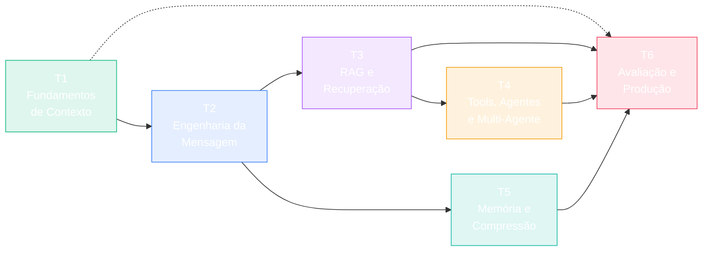

# FEC — Formação de Engenharia de Contexto

> **Tese editorial:** Engenharia de Contexto é a disciplina de projetar, montar, comprimir, persistir e avaliar a janela de contexto que um modelo recebe — não "prompt engineering" enfeitado.

[](./CHANGELOG.md)
[](./CHANGELOG.md)
[](./LICENSE)
[](./LICENSE-CODE)

Curso master avançado em PT-BR sobre Engenharia de Contexto para LLMs. Padrões agnósticos de provedor (Claude, GPT, Gemini, open-source). Formato INEMA.CLUB com máximo de ilustrações, exercícios testáveis e projetos cumulativos.

---

## Mapa do curso



| Trilha | Cor | Módulos GA (v1.0) | Beta (post-launch) |
|--------|-----|-------------------|--------------------|
| **T1 — Fundamentos de Contexto** | 🟢 emerald | 1.1, 1.2 | — |
| **T2 — Engenharia da Mensagem** | 🔵 blue | 2.1, 2.2 | — |
| **T3 — RAG e Recuperação** | 🟣 purple | 3.1, 3.2 | 3.3 |
| **T4 — Tools, Agentes e Multi-Agente** | 🟠 amber | 4.1, 4.2 | 4.3 |
| **T5 — Memória e Compressão** | 🔷 teal | 5.1 | 5.2 |
| **T6 — Avaliação e Produção** | 🔴 rose | 6.1 | 6.2 |

**Total v1.0:** 10 módulos GA + 4 beta + 3 projetos GA (P1, P2, P5) + 2 opcionais (P3, P4).

---

## Comece aqui

1. **Verifique pré-requisitos:** [PRE-REQUISITOS.md](./PRE-REQUISITOS.md).
2. **Leia o escopo** (o que está dentro / fora): [ESCOPO.md](./ESCOPO.md).
3. **Instale o cliente do curso:**
   ```bash
   pip install fec-sdk==<versão da release> --require-hashes -r releases/v1.0.0/lockfile.toml
   ```
4. **Abra a landing local:** `open index.html` (ou acesse a versão hospedada quando publicada).
5. **Siga a trilha 1** em `curso/trilha1/index.html`.

⚠️ **Canal canônico de download:** sempre o asset nomeado `fec-vX.Y.Z.zip` da [GitHub Release](https://github.com/inematds/FEC/releases). Os "Source code (zip/tar.gz)" auto-gerados pelo GitHub **não são auditados**.

---

## Status do projeto

Em desenvolvimento ativo seguindo o [PLAN.md](./PLAN.md) (95 itens, endurecido por 5 rodadas adversariais — ver [RELATORIO-CLAUDEX.md](./RELATORIO-CLAUDEX.md)).

- 🔴 **Não publicado.** v1.0.0 prevista para maio/2026.
- 🟡 **Apenas scaffolding.** Conteúdo dos módulos será adicionado em ondas (T1 piloto → T2-T3 → T4-T6).
- ✅ **Plano completo** com gates objetivos, harness de avaliação congelado, runbooks de incidente, e protocolo de release atômico.

Acompanhe o progresso em [`docs/status.html`](./docs/status.html) (publicado em GitHub Pages após primeiro release).

---

## Diferencial editorial

- **Provider-neutral primeiro.** Cada padrão é ensinado em forma agnóstica e depois materializado em provedor canônico do módulo, com adaptadores para os outros e mocks para casos não-portáveis.
- **Toda alegação de ganho roda no harness** [`evals/v1/`](./evals/v1/) — datasets, judges e modelos pinados; sem cherry-pick.
- **Seção "Quando NÃO usar"** obrigatória em todo padrão — RAG, agente, multi-agente, memória, caching.
- **Exercícios com teste automatizado.** Aluno roda `pytest` e sabe se passou — não "achismo".
- **Sandbox obrigatório** para todo lab que toca filesystem/processo/rede. Bateria de testes de traversal antes de virar GA.

---

## Estrutura do repositório

```
FEC/
├── PLAN.md, RELATORIO-CLAUDEX.md     # plano endurecido + relatório do loop
├── ESCOPO.md, PRE-REQUISITOS.md, GLOSSARIO.md, CHANGELOG.md
├── SECURITY.md, RUNBOOK.md, ALERTS.md, RELEASE-INCIDENT.md
├── COMPAT.md, MODELOS.md, CAPACIDADES.md  # gerados de evals/v1/*.json
├── index.html                         # landing INEMA
├── curso/trilha[1-6]/{index,modulo-X-Y}.html
├── fec_sdk/                           # cliente abstrato + adaptadores + sandbox
├── exemplos/, exercicios/, solucoes/
├── projetos/{P1,P2,P5}/ + projetos/post-launch/{P3,P4}/
├── quizzes/*.json
├── evals/v1/{compat,revoked_versions,budgets,models,capabilities,...}.json
├── schemas/*.schema.json              # JSON Schema 2020-12 — source of truth
├── assets/{css/, diagrams/, csp/, banners/}
├── runbooks/                          # playbooks por classe de falha
├── postmortems/                       # incidentes públicos
├── releases/v<X.Y.Z>/lockfile.toml
└── scripts/                           # automações de validação, build, release
```

---

## Contribuindo

Veja [CONTRIBUTING.md](./CONTRIBUTING.md). Fluxos:

- **Errata** → issue com label `errata` (templates em `.github/ISSUE_TEMPLATE/`).
- **Dúvida** → issue com label `duvida`.
- **Sugestão de tópico/módulo** → RFC em PR.
- **Conteúdo novo** → segue o contrato fixo de módulo (item 18 do PLAN).

CODEOWNERS bloqueia mudanças em `.github/workflows/**`, `evals/**`, `MODELOS.md`, `BUDGETS.md` — exigem aprovação de maintainer.

---

## Licenças

- **Conteúdo (texto, ilustrações, slides):** [CC BY-SA 4.0](./LICENSE)
- **Código (exemplos, exercícios, fec_sdk, scripts):** [MIT](./LICENSE-CODE)
- **Terceiros:** ver [LICENSES-THIRD-PARTY.md](./LICENSES-THIRD-PARTY.md) (datasets, screenshots, papers citados).

---

## Segurança

Encontrou vulnerabilidade? Veja [SECURITY.md](./SECURITY.md) — não abra issue público; use o canal privado descrito lá.

---

**Mantido pelo INEMA — [inema.club](https://inema.club).**
